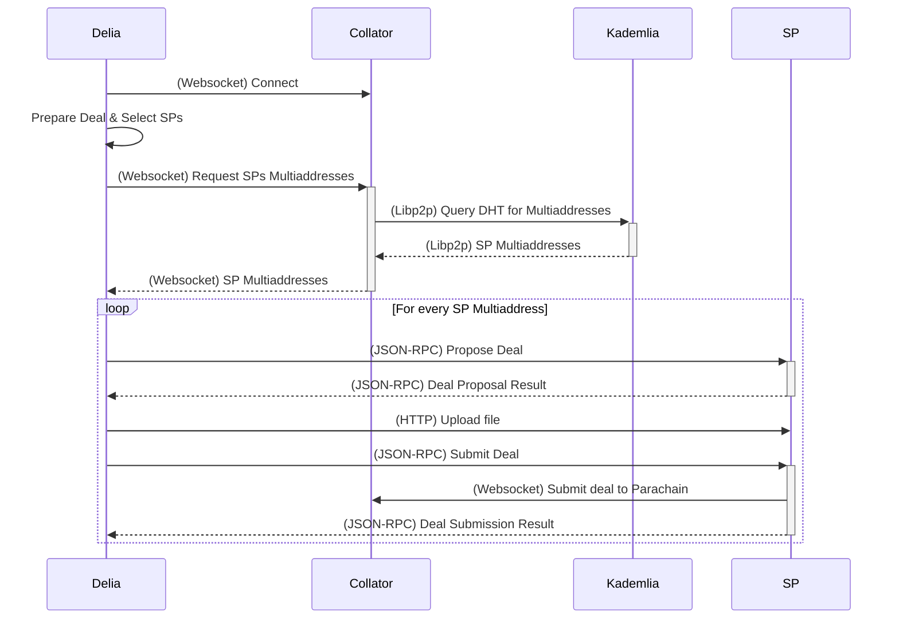

# Developing Delia

Delia's stack aims to be straightforward and opinionated,
using Typescript, Vite and Biome as the major development tools
and React & Tailwind for the frontend due to their ubiquity.

## Environment Setup

> [!WARNING]
> Delia requires a running parachain. Given that, currently,
> there are no publicly deployed instances, you should run your own testnet
> in case you're looking to take Delia for a spin.

Delia requires `pnpm`, which you can install in variety of ways:

* [Through the official guide](https://pnpm.io/installation)
* [Using Volta to install it](https://volta.sh/)
* Or, if you're using `nix`; running `nix develop`

### Install dependencies

```bash
pnpm i
# Or, sometimes this may come in handy
pnpm i --frozen-lockfile
```

### Setup husky

After installing `pnpm` and the dependencies, you'll need to get husky up and running.
You can do so using the following command:

```bash
pnpm prepare
```

### Running

You can run the development setup with:

```bash
pnpm run dev
```

And format and lint it with:
```bash
pnpm run fmt && pnpm run lint
```

## Using accounts

Delia will require you to use the Polkadot.js browser extension,
for testing purposes, we recommend you add Alice's account to your wallet,
the seed phrase for it is <sup><a href="https://stackoverflow.com/a/70518514">1</a>,
<a href="https://github.com/polkadot-developers/substrate-developer-hub.github.io/issues/613">2</a></sup>:

```
bottom drive obey lake curtain smoke basket hold race lonely fit walk//Alice
```

## Running the testnet

Briefly, to run the testnet you will first need to clone the [`eigerco/polka-storage`](https://github.com/eigerco/polka-storage) repo:

```bash
git clone git@github.com:eigerco/polka-storage.git
```

After setting up your development environment, you can run a local testnet with:
```bash
just testnet
```

This will run a [`zombienet`](https://github.com/paritytech/zombienet) network with two validators and one collator.
It will also set up some state for you, like adding balance to `Alice`, `Bob` and `Charlie`.

For more information, you should refer to the [Polka Storage Book](https://eigerco.github.io/polka-storage-book).

## Detailed Deal Submission Flow

Here you can find a more detailed version of the deal submission flow present in the `README`.


