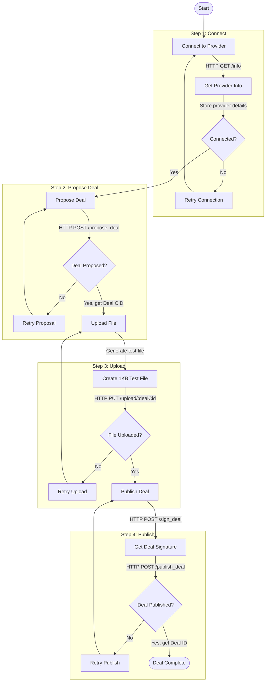

# Delia

This is a POC for Delia - a React web application for proposing and publishing deals with providers. This application provides a step-by-step interface to connect to providers, propose deals, upload test files, and publish storage deals (on the Polka Storage System Parachain).

## Features

- Connect to storage providers via configurable URLs
- View provider information and status
- Create and propose storage deals
- Generate and upload test files
- Sign and publish deals with automatic SCALE encoding

## Technical Stack

- React
- Tailwind CSS
- lucide-react for icons
- Fetch API for network requests

## Flow Diagram



## Prerequisites

In order for the POC to work properly, please ensure that you have:
1. the testnet running (`just testnet` from the Polka Storage repo)
2. added balances to Alice and Charlie
3. registered Charlie as a storage provider
4. started the storage provider server (with something like `RUST_LOG=trace cargo run -- \
  --sr25519-key //Charlie \
  --seal-proof "2KiB" \
  --post-proof "2KiB" \
  --database-directory ./tmp/db \
  --storage-directory ./tmp/storage`)

## Getting Started

1. Clone the repository
```bash
git clone <repository-url>
cd storage-deal-flow
```

2. Install dependencies
```bash
npm install
# or
yarn install
```

3. Start the development server
```bash
npm run dev
# or
yarn dev
```

4. Open http://localhost:5173 in your browser

## API Endpoints

The application interacts with the following endpoints:

- `GET /info` - Get provider information
- `POST /propose_deal` - Propose a new storage deal
- `PUT /upload/:dealCid` - Upload file for a proposed deal
- `POST /sign_deal` - Get deal signature
- `POST /publish_deal` - Publish the signed deal

By default, the application connects to:
- Main API: `http://127.0.0.1:8000`
- Upload service: `http://127.0.0.1:8001`

## Demo
https://github.com/user-attachments/assets/0f51c61e-04c7-4507-a4d5-39e05f46f55f
