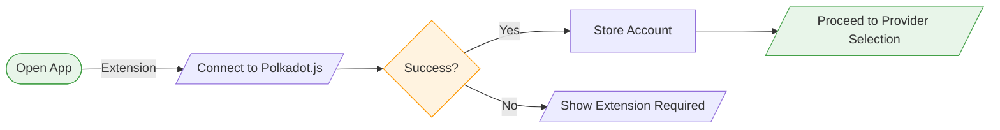
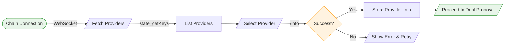
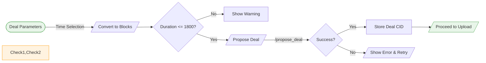
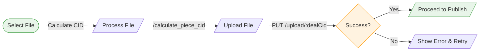
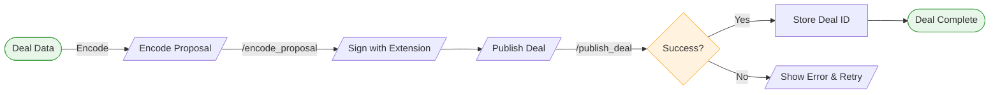

# Delia

This is an MVP for Delia - a React web application for proposing and publishing deals with providers on the Polka Storage System Parachain. This application provides a step-by-step interface to connect to providers, propose deals, upload files, and publish storage deals.

## Features

- Connect to storage providers via automatic discovery from the chain
- View provider information and status
- Create and propose storage deals with:
  - Flexible time selection using calendar and 30-minute interval picker
  - Block number visualization and conversion
  - Maximum deal duration limit of 1800 blocks
  - Real-time cost estimation
- Upload a file
- Sign and publish deals with automatic SCALE encoding (signing is done via the polkadot.js browser wallet)
- Real-time chain synchronization

## Technical Stack

- React
- Tailwind CSS
- lucide-react for icons
- WebSocket for chain communication
- Fetch API for provider interactions

## Flow Diagrams

### Step 1: Connect Wallet


### Step 2: Select Provider


### Step 3: Propose Deal


### Step 4: Upload File


### Step 5: Publish Deal


## Prerequisites

In order for the MVP to work properly, please ensure that you have:

1. The testnet running (`just testnet` from the Polka Storage repo)
2. Added balance to a chosen storage provider account eg. Charlie (as well as to the account you'll use as a client)
3. Registered Charlie as a storage provider
4. Started the storage provider server:
```bash
RUST_LOG=trace cargo run -- \
  --sr25519-key //Charlie \
  --seal-proof "2KiB" \
  --post-proof "2KiB" \
  --database-directory ./tmp/db \
  --storage-directory ./tmp/storage
```
5. Installed the Polkadot.js extension

## Getting Started

1. Clone the repository
```bash
git clone <repository-url>
cd delia
```

2. Install dependencies
```bash
npm install
# or
yarn install
```

3. Start the development server
```bash
npm run dev
# or
yarn dev
```

4. Open http://localhost:5173 in your browser

## Network Configuration

The application connects to:
- Chain WebSocket: `ws://127.0.0.1:42069`
- Provider API: `http://<provider-ip>:8000`
- Upload service: `http://<provider-ip>:8001`

## Deal Constraints

- Maximum deal duration: 1800 blocks
- Minimum deal start: Current block + 1
- Time selection: 30-minute intervals
- Block time: ~6 seconds

## Time Selection Interface

The application provides two modes for setting deal duration:
1. **Block Mode**
   - Direct block number input
   - Real-time validation against chain state
   - Duration limit checking

2. **Time Mode**
   - Calendar-based date selection
   - 30-minute interval time dropdown
   - Automatic conversion to/from block numbers
   - European date format (DD/MM/YYYY)

## Video demo

https://github.com/user-attachments/assets/ebb675eb-0cd0-47c5-89d2-87e6e586e6f7
