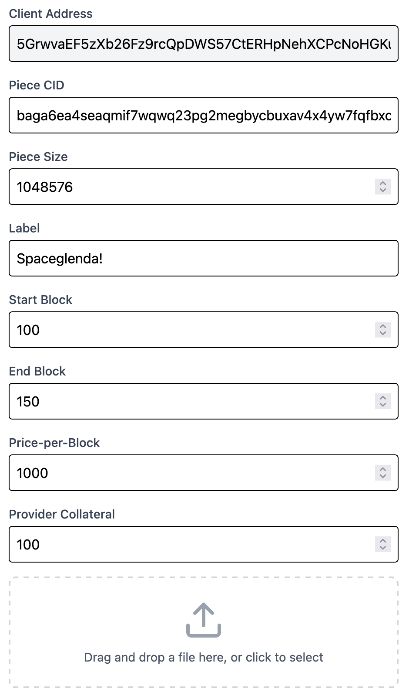
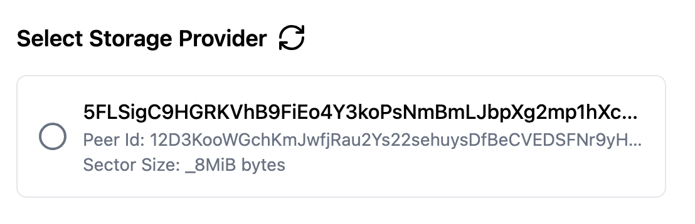

# Delia

> [!WARN]
> This project is under active development!

The Delia project is a complement to the [Polka Storage](https://github.com/eigerco/polka-storage) project,
being the frontend for file upload to the network's providers.

## Getting Started

The stack aims to be straightforward and opinionated,
using Typescript, Vite and Biome as the major development tools
and React & Tailwind for the frontend due to their ubiquity.

### Installation

Delia requires `pnpm` for development, you can install it in a variety of ways:
* [Through the official guide](https://pnpm.io/installation)
* [Using Volta to install it](https://volta.sh/)
* Or, if you're using `nix`; running `nix develop`

After setting up `pnpm`, you can install the project with:

```bash
pnpm i
```

### Running

You can run the development setup with:

```bash
pnpm run dev
```

And format and lint it with:
```bash
pnpm run fmt && pnpm run lint
```

## Usage

### Accounts

As a user, Delia will require you to use the Polkadot.js browser extension,
for testing purposes, we recommend you add Alice's account to your wallet,
the seed phrase for it is <sup><a href="https://stackoverflow.com/a/70518514">1</a>,
<a href="https://github.com/polkadot-developers/substrate-developer-hub.github.io/issues/613">2</a></sup>:

```
bottom drive obey lake curtain smoke basket hold race lonely fit walk//Alice
```

If you're using your own keys, you will need to have funds available to perform deals.

### Preparing a deal

#### Filling in information about your file



<!-- TODO: add a full explainer here, or create one in the book and refer to it -->
* **Piece CID** — A unique identifier for your file, it is calculated with the `polka-storage-provider-client` tool.
* **Piece Size** — The piece size for your file, it is calculated with the `polka-storage-provider-client` tool (this number *MUST* be a power of two).
* **Label** — A string up to 128 characters long, can contain anything you wish.
* **Start Block** — The block at which the deal becomes active.
* **End Block** — The block at which the deal ends.
* **Price-per-block** — The price to pay for each block during which the file is stored.
* **Provider Collateral** — The price the storage provider gives up if they fail to uphold their end of the deal.

#### Selecting your storage provider



* **Refresh** — Will fetch the list of storage providers.
* **Storage Provider** — The storage provider's account ID, Peer ID and supported sector size.
