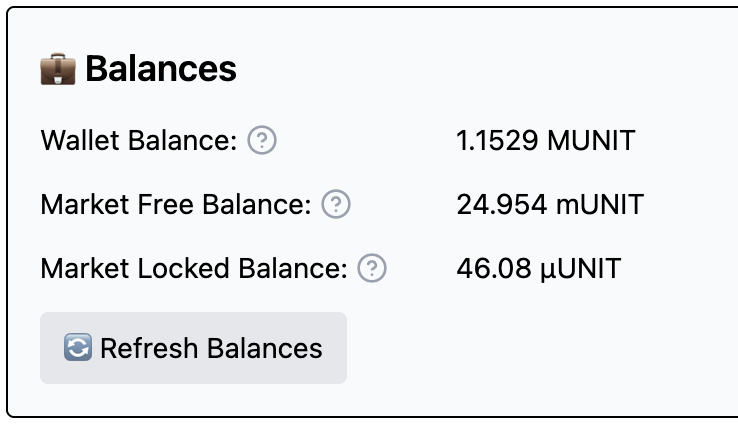

# Delia

> [!WARNING]
> This project is under active development!

The Delia project is a complement to the [Polka Storage](https://github.com/eigerco/polka-storage) project,
being the frontend for file upload to the network's providers.

## Getting Started

### Polkadot Extension

Delia will require you to use the [Polkadot.js browser extension](https://polkadot.js.org/extension/).
For instructions on how to add your own account, refer to the extension documentation:

* https://polkadot.js.org/docs/extension/usage
* https://polkadot.js.org/docs/extension/

### Setting up your balance

Before you create a deal, you need some balance in your market account.
Currently, the (local and internal) testnet provides you with a faucet function that you can find in Delia's landing page.

As you can imagine, once you click the button, 10 tokens will be added to your account's balance.
After clicking, you should see a success message, as below:

> [!NOTE]
> The faucet takes a bit of time to finish,
> this is due to waiting for the transaction to be [finalized](https://docs.polkadot.com/polkadot-protocol/architecture/polkadot-chain/pos-consensus/#finality-gadget-grandpa).

Note that the faucet will only give out tokens every 24 hours, in the case you tried getting tokens earlier, you should see the following message:

#### Checking your account's balance

You can also check your account's network and market balance with Delia:

### Preparing a storage deal

1. Start by selecting an account from the *Client Account* field.

2. Select your file, either by dragging it or clicking the following field:

3. (Optional) You can add a description to your deal.

4. Select your deal's duration.

5. Finally, select your storage providers:

6. Click "Continue" to sign your deals and you're done!
   After the deal is finished, you should receive a receipt file,
   it will come in handy to retrieve your files!

### Retrieve your file

To retrieve your file, simply upload the receipt you received upon finishing your deals
in the "Deal Retrieval" page and press "Continue".

## Q&A

### How does Delia connect to the chain?

Delia connects to the parachain collator using the address defined in the top right corner of the page:

After a connection is established, performing a deal works roughly as described in the following diagram:

For more details, refer to the [`DEVELOPMENT.md`](DEVELOPMENT.md).
